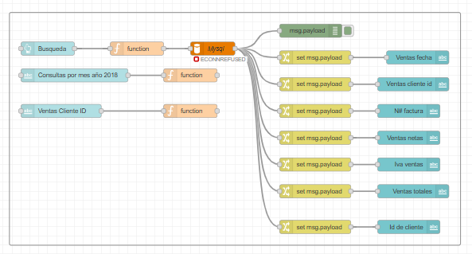
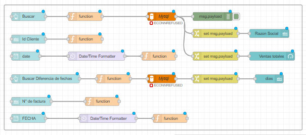
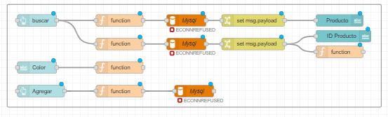
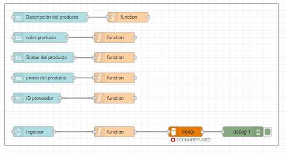

# 🌐 Node-RED Project: Actividad MySQL y Node-RED

Este proyecto fue desarrollado en **Node-RED** como parte de una actividad académica de 5to semestre, explorando sus funciones y la capacidad de integración con bases de datos como **MySQL**. La actividad consistió en **conectar un Dashboard de Node-RED con una base de datos MySQL**, permitiendo ingresar información o consultar datos directamente desde el panel, **sin necesidad de acceder manualmente a MySQL**.

---

## 🧠 Descripción general

Este flujo de Node-RED realiza las siguientes funciones:
- 📡 **Entrada:** los datos usados son de 'curso.sql'. 
- ⚙️ **Procesamiento por Actividad:** El flujo se compone de **5 actividades principales**, cada una enfocada en una funcionalidad específica dentro de Node-RED y MySQL.
  
---
  ### 🟢 Actividad 1 – Traer Los nombres de los proveedores
  - Se utiliza un Text Input para ingresar el ID del proveedor, el cual se envía mediante un botón de búsqueda.
  - El botón inyecta el ID en la base de datos a través de un nodo Function, donde se formula la consulta SQL.
  - El nombre asociado al ID se obtiene desde la base de datos y se muestra en un nodo Dashboard Text.

  

    
  ### 🟣 Actividad 2 – Traer datos de una fecha y ventas de cliente especifico
  - Se usan dos Text Input: uno para el ID de venta del cliente y otro para el mes.
  - El nodo Function está configurado para traer exclusivamente los datos del año 2018, por lo que solo filtra por mes.
  - Al presionar el botón, se ejecuta la búsqueda en la base de datos y se obtienen todos los registros asociados al ID y mes indicados.
  - Un nodo Change se utiliza para seleccionar los datos relevantes que serán mostrados en los nodos de texto del Dashboard.
    

  

    
  ### 🔵 Actividad 3 – Consulta de datos de cliente y diferencia de fechas
  - Se realiza una búsqueda usando el ID del cliente y una fecha específica.
  - El flujo obtiene la razón social del cliente y la suma total de ventas realizadas.
  - Además, se ejecuta una segunda consulta para calcular la diferencia de días entre una factura específica y la fecha establecida en la base de datos.

  

  
  ### 🟠 Actividad 4 – Actualización de datos existentes
  - Se busca un producto que se encuentre en la parte más baja de la tabla y que tenga el campo Color sin asignar.
  - A través de un Text Input, el usuario puede ingresar un color.
  - Al presionar el botón Agregar, el flujo envía el nuevo color y actualiza el campo correspondiente en la base de datos.
    

  

  ### 🔴 Actividad 5 – Ingreso de nuevos productos a la Tabla Productos
  - En esta última acción se permite ingresar un producto nuevo dentro de la tabla de productos, completando todos los campos requeridos.
  - Mediante un botón, los datos se inyectan hacia un nodo Function, que se encarga de construir la sentencia SQL e insertarla en la base de datos.
  - También se incluye la funcionalidad para eliminar registros específicos según el ID del producto.

  

    
---

- 🧩 **Nodos adicionales utilizados:** Algunos nodos no son predeterminados en Node-RED, pero pueden descargarse desde el Manage Palette:
  - node-red-node-mysql
  - node-red-contrib-moment2
  
---

## 🖼️ Vista del Dashboard

  

---

## 🚀 Cómo usarlo

1️⃣ **Instala y abre XAMPP**
- Asegúrate de que los servicios Apache y MySQL estén activos.
- XAMPP se utiliza para crear una ruta local segura y permitir la conexión entre Node-RED y MySQL.
- Toma nota del puerto asignado a MySQL (por defecto suele ser 3306, pero puede variar según tu configuración).

2️⃣ **Configura la base de datos MySQL.**
- Abre tu cliente de MySQL (por ejemplo, MySQL Workbench o consola).
- Crea una base de datos llamada curso.
- Importa el archivo curso.sql si está disponible (contiene las tablas necesarias para el proyecto).

3️⃣ **Abre Node-RED** en tu entorno local.

4️⃣ Ve al menú → *Import* → *Clipboard*. 

5️⃣ Pega el contenido del archivo [`Union BD dashboard 2.json`](./Union%20BD%20dashboard%202.json) y el de [`Union BD dashboard.json`](./Union%20BD%20dashboard.json).

6️⃣ **Verifica la configuración del nodo MySQL:**  
   - Host: `localhost`  
   - Port: *(el puerto mostrado en XAMPP, normalmente `3306`)*  
   - User: `root` (si no tienes user lo puedes dejar en blanco)  
   - Password: *(vacía por defecto, o la que hayas definido)*  
   - Database: `curso`  

7️⃣ Da clic en **Deploy** y abre tu Dashboard desde  
   👉 `http://localhost:1880/ui`

---

## ⚙️ Tecnologías utilizadas
- Node-RED   
- JavaScript (en nodos Function)  
- Dashboard UI  
- Xampp

---

## 🧠 Aprendizaje y resultados

Durante este proyecto aprendí a:
- Iniciación en flujos eficientes y modulares en Node-RED.  
- Usar nodos de lógica y visualización para datos dinámicos.  
- Diseñar interfaces en Node-RED 

---

## 📎 Créditos
Creado por **[Nicolle Galvis](https://github.com/NicolleGalvis)** 🪄  

📧 Contacto: [nicollegalvis03@gmail.com](mailto:nicollegalvis03@gmail.com) 

🔗 LinkedIn: [Nicolle Galvis](https://www.linkedin.com/in/nicolle-galvis-640422270?utm_source=share&utm_campaign=share_via&utm_content=profile&utm_medium=android_app) 

---

